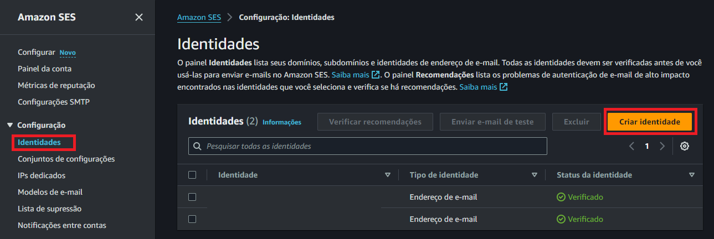
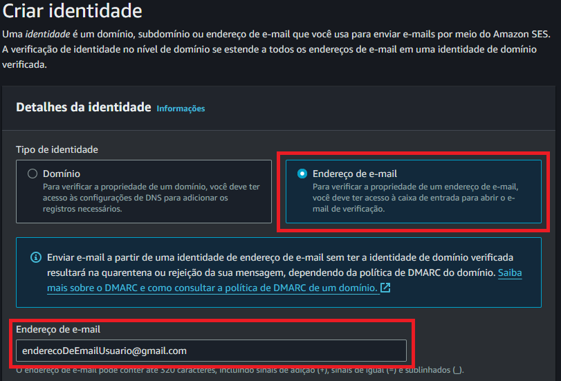

# Envio de Emails com AWS Lambda e Python

## Ferramentas
Python 3.12: [Download Python](https://www.python.org/downloads/) &nbsp;&middot;&nbsp;  
AWS: [AWS Amazon Web Services](https://aws.amazon.com/pt/) &nbsp;&middot;&nbsp;

# Documentação e Forma de Criação

## AWS
Crie uma Conta AWS: [AWS Amazon Web Services](https://aws.amazon.com/pt/) &nbsp;&middot;&nbsp;
  
   

## AWS Lambda
<a>1 - Selecione a melhor região desejada </a>  
   
<a>2 - Selecione o serviço AWS Lambda</a>  
   
<a>3 - Selecione "Painel" e clique em "Criar Função"</a>  
   
<a>4 - Configure a função - Adicione Nome</a> 
<a>5 - Configure a função - Adicione Linguagem(neste caso Python 3.12)</a> 
<a>6 - Crie a função</a>  
   
<a>7 - Crie a função</a>  

## Criar Codigo
<a>1 - Adicione o codigo de "funcao_lambda_v3.py" ao arquivo "lambda_function.py" na função</a> 
<a>2 - Clique em "Deploy"</a>  
   

## Criar Teste 
<a>1 - Navegue até o campo "Testar"</a> 
<a>2 - Adicione o nome para evento</a> 
<a>3 - Adicione o codigo JSON de "jsonTeste.json" em "JSON do evento"</a> 
<a>4 - Preencha os campos de "JSON do evento" com os dados necessarios</a> 
<a>5 - Dados: Email do Destinatario, Titulo e Assunto</a> 
<a>6 - Clique em salvar</a>  
   

## Configuração de SES(Amazon Simple Email Service)
<a>1 - Volte para o "Console AWS" e Busque por "SES"</a> 
<a>2 - Clique em "Amazon Simple Email Service"</a>  
   
<a>3 - Clique em "Começar"</a>  
   
<a>4 - Vá até "Identidades" na barra lateral esquerda</a> 
<a>5 - Clique em "Criar identidade"</a>  
  
<a>6 - Selecione a opção "Endereço de e-mail"</a> 
<a>7 - Adicione o email do destinatario</a>  
  
<a>8 - Clique em "Criar identidade"</a> 
<a>9 - A AWS irá enviar um email para destinatario solicitando a confirmação do Email</a> 
<a>10 - Basta clicar no Link para validar</a>  
  
<a>11 - Após isso volte ao Amazon SES e o email estará verificado</a>  
  
<a>12 - É necessario adicionar no minimo 2 Emails(Origem e Destino)</a> 

## Configuração de IAM para permissão de envio
<a>1 - Volte para o "Console AWS" e Busque por "IAM"</a> 
<a>2 - Clique em "IAM"</a>  
  
<a>3 - Clique em "Funções" barra lateral esquerda</a> 
<a>4 - Clique na função</a>  
  
<a>5 - Em adicionar "Adicionar permissões" selecione "Anexar Políticas"</a>  
  
<a>6 - Busque por "AmazonSESFullAccess"</a> 
<a>7 - Selecione e clique em adicionar Permissão</a>  
  
<a>8 - Após isso volte para "Console AWS"</a> 

## Execução de Envio
<a>1 - Volte para o "Console AWS" e Busque por "Lambda" e a acesse</a> 
<a>2 - Acesse a função</a> 
<a>3 - No código adicione o email de origem na variavél "email_from"</a>  
  
<a>4 - Clique em "Deploy" e vá para a aba de "Testar"</a> 
<a>5 - Adicione o email do destinatario no campo "email_to" no campo "JSON do evento"</a> 
<a>6 - Clique em "Testar"</a>  
  
<a>7 - A seguinte LOG será lançada</a>  
  
<a>8 - E o email será enviado</a>  
  
  
<a>9 - Finalizando o processo</a>  

## Possivéis erros e soluções
<a>1 - Tempo de Execução</a> 
<a>2 - Erro de validação de SES</a> 
<a>3 - Erro de validação de IAM</a> 
<a>4 - Erro de digitação de código</a> 
<a>5 - Email não adicionado</a> 
<a>6 - Email Inválido</a> 

## Possivéis erros e soluções
<a>1 - Alterar tempo nas configurações da Lambda</a> 
<a>2 - Verificar e Alterar informações de SES</a> 
<a>3 - Verificar e Alterar informações de IAM</a> 
<a>4 - Revisar código</a> 
<a>5 - Adicionar email ao SES</a> 
<a>6 - Adicionar email valido ao SES</a> 
